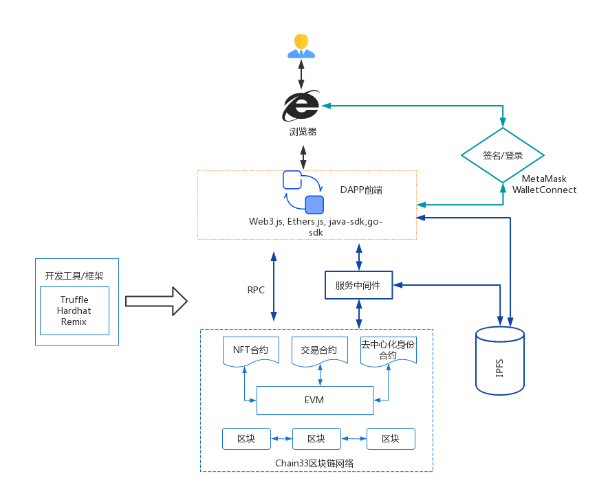

## L1 Chain33 DAPP开发简介

### 1.课程整体目录
 - Chain33 DAPP 开发概念介绍
 - Chain33 私链开发环境搭建
 - Chain33 DAPP开发工具和框架简介
 - Web3.js 和chain33区块链交互
 - Ethers.js和Chain33区块链交互
 - web3J-sdk 和Chain33区块链交互
 - go-ethereum 和Chain33区块链交互
 - 使用Truffle框架在Chain33上做开发
 - 使用HardHat框架在Chain33上做开发
 - Chain33上DAPP应用开发实例（前端开发, 合约开发）
 - 其它

###  2. 什么是Chain33
    开源地址：
    https://github.com/33cn/chain33
    https://github.com/33cn/plugin

    一些数据：
    开源协议： BSD-3
    commit数：11351
    贡献人数： 36
    功能特性： 支持跨链，零知识证明，以太坊兼容

###  3.DAPP应用常用架构

