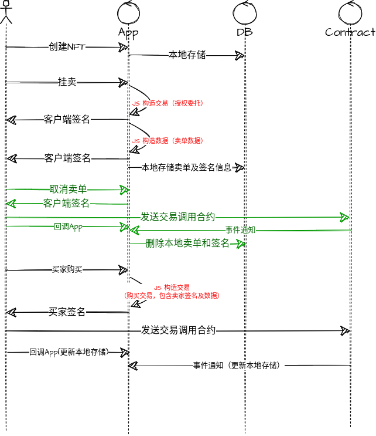
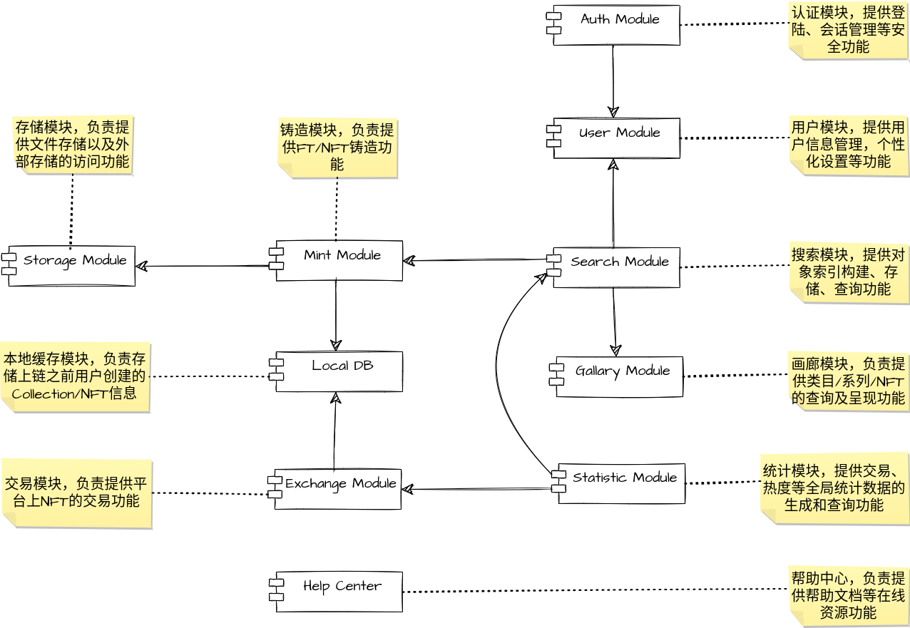
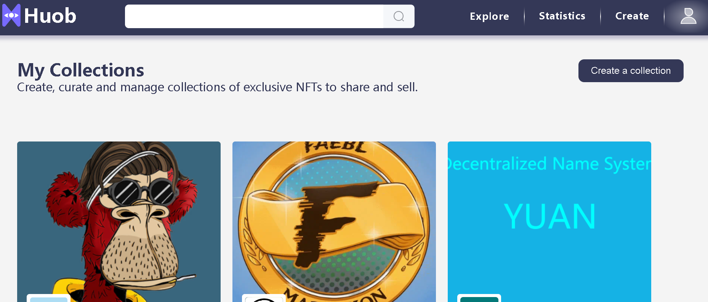
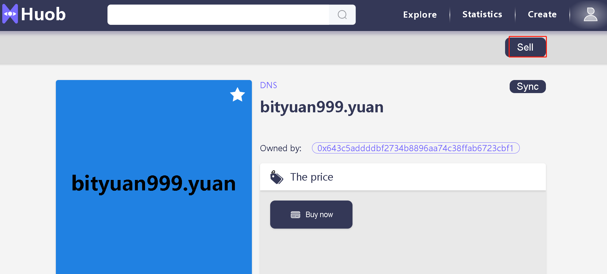
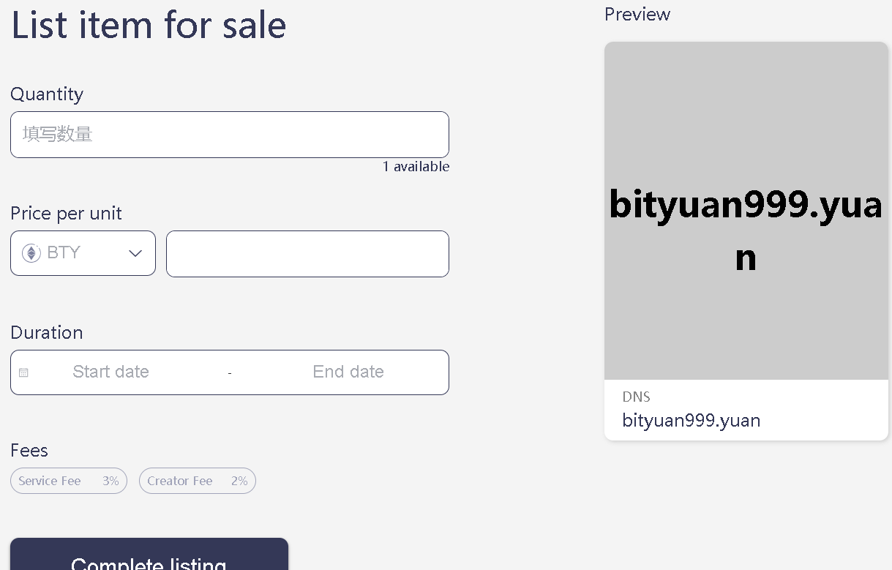
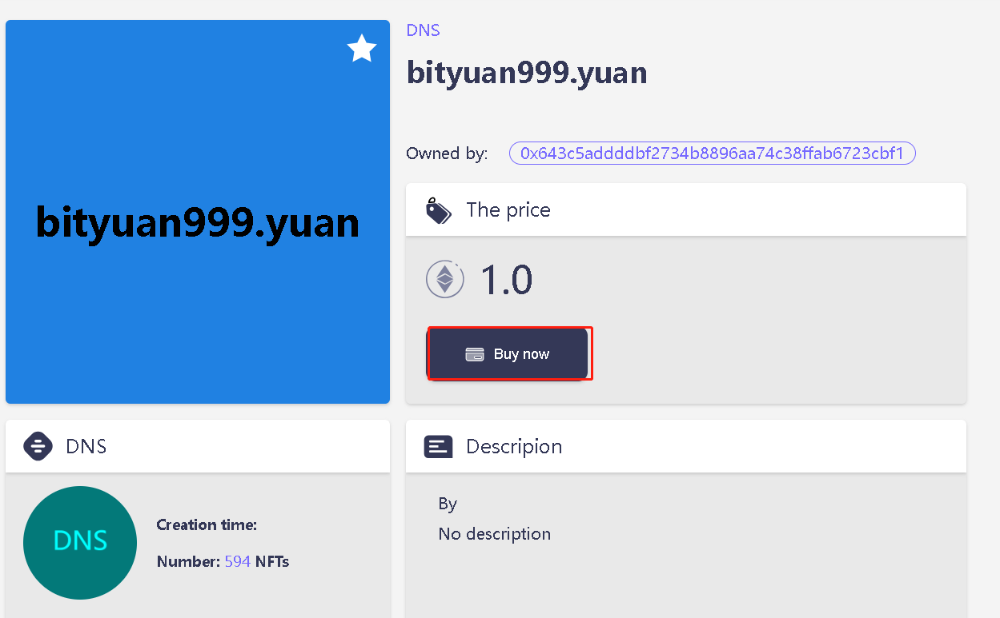
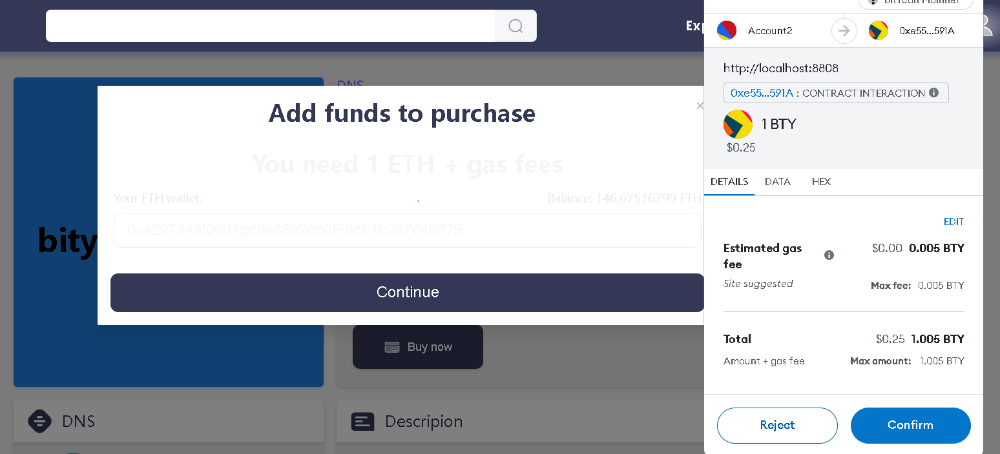
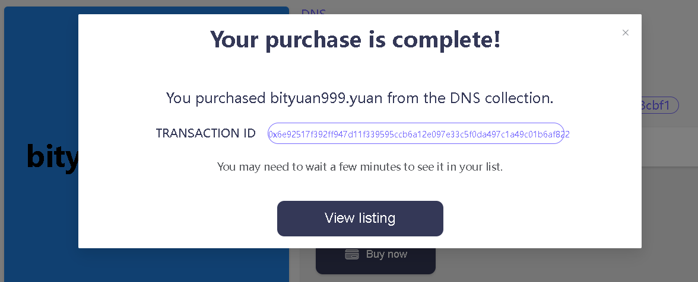
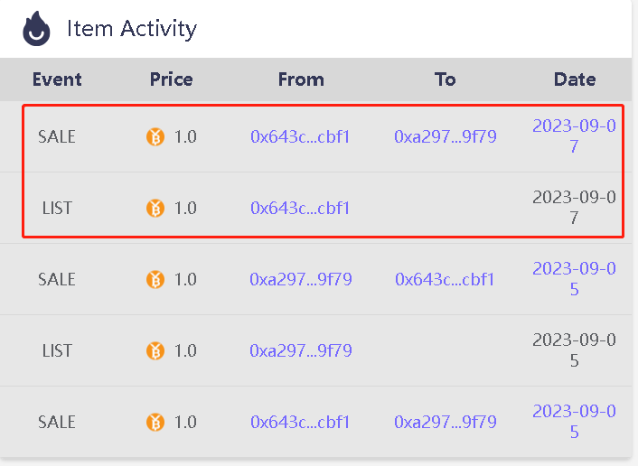

# BTY链上的去中心化NFT交易系统
## 产品介绍
平台测试链接（非正式版本）： [http://121.52.224.92:18000/](http://121.52.224.92:18000/)  
- 去中心化交易系统是实现基于BTY公链的NFT资产交易的系统， 支持用户在平台上创建NFT资产（ERC1155），并且挂卖出售；也支持导入外部的NFT资产（ERC1155和ERC721（比如BTY上的域名）两种形式）到平台上进行挂卖出售。   

## 技术架构
技术架构：[去中心化平台架构介绍](https://github.com/andyYuanFZM/Chain33_Dapp_develop/blob/main/L18%20%E6%A1%88%E4%BE%8B%E4%BB%8B%E7%BB%8D/%E5%8E%BB%E4%B8%AD%E5%BF%83%E5%8C%96%E5%9F%9F%E5%90%8D%E7%B3%BB%E7%BB%9F.md#%E6%8A%80%E6%9C%AF%E6%9E%B6%E6%9E%84)

## 交易合约介绍
| 合约名称 | 功能介绍 |
| ------ | ---------- | 
| consideration | 对价合约，负责将链外订单在链上执行：  1. 支持订单全部成交，部分成交功能。  2. 支持校验订单和取消订单功能。  3. 支持获取订单hash， 状态，对价合约信息等功能 | 
| AssetContract | 资产合约,实现一套完整的NFT/FT铸造平台： 1. 支持资产的铸造，批量铸造，转移，销毁，元数据设置， 查询等功能 | 

## 交易流程介绍
### 1. 创建并出售

 - 设计时，考虑节省用户的手续费， 所以用户在创建NFT并挂卖这两步交易都在链下构造完成，并由钱包插件签名后存储在数据库中（不上链）。
 - 买家购买时，组合他的购买交易，以及上一步存储在数据库中的卖家签过名的交易，并且签名后上链。
 - 服务端监听链上事件，当交易执行成功后，再更新本地存储。

### 2. 创建并赠送
 
 - 创建NFT的交易在链下完成构造，并存储在数据库中（不上链）
 - 转赠动作发生时，再签名交易后上链。
 - 服务端监听链上事件，当交易执行成功后，再更新本地存储。

## 平台功能模块设计

## 功能简介
### 1. 用户登录
- 通过MetaMask签名数据， 服务端检验签名， 签名验证通过则登录成功。

### 2. 集合创建
#### 2.1 创建集合

- 在[My]-[My collections]下点击[Create a collection]按钮来创建一个集合

#### 2.2 输入集合信息
平台的设计思路是将NFT包含在集合下面， 所以在创建NFT之前需要先创建集合。
- 输入集合的Logo, banner, 名称， 描述等信息
- 选择区块链（当前只支持BTY公链）
- 合约地址：指的是NFT资产的合约地址，如果不填代表创建一个空的新集合； 如果填了，系统会根据合约地址从区块链上拉取相应的NFT放在该集合下。
- 选择集合的类型（艺术品，收藏品）
- 填写版税百分比和版税接收地址
- 点击创建完成集合创建（目前针对外部导入的集合，在创建完集合后，还需要管理员在后台审核一下，程序才会去链上拉取数据）

### 3. NFT挂卖

- 选择要出售的NFT(这边以域名为例)
- 点击[sell]按钮，此处会弹出钱包插件，要求用户确认。
- 用户确认，并等待交易在链上执行成功后，会切换到出售详情页，如下图

- 填写上架数量，出售价格，上架时间等参数
- 点击complete listing按钮， 在弹出的钱包插件中点击签名按钮，完成NFT上架操作。

### 4. 买入NFT

- 选择一个已经上架出售的NFT, 点击[Buy now]按钮。
- 在弹出的输入框中输入购买数量，点击[Complete purchase]。
- 确认当前用户地址下账户余额足够，再点击[continue]按钮。  之后会弹出钱包插件，显示需要支付的费用（包括购买费用和链上手续费） 如下图：

- 在钱包插件中点击confirm, 交易签名并上链，同时返回交易hash。  如下图

### 5. 查询结果

- 进入购买的NFT详情页，可以看到该NFT是由谁挂单的，被谁购买的。
