# BTY链上的去中心化域名系统
## 产品介绍
平台链接： [http://dns.bityuan.com](http://dns.bityuan.com)  
- 去中心化域名系统（Decentralized Name System，简称DNS）是基于BTY公链的身份系统，它的目标是去中心化地管理用户身份，使区块链身份更加安全、可靠、透明和易于使用。  
- 设置不同的二级域名，用于多种情景，取代复杂的地址信息， 可通过DNS的解析系统，建立不同的二级域名，并设置对应的解析内容。使其更加灵活的满足您的应用需求。（以您的名字注册域名，并设置二级域名：BTY.yourName.yuan 将其解析为您在BTY公链上的地址。在转账等其他操作时，可输入该域名来代替。）  
- 提供多种后缀，使用更加灵活， 目前提供.yuan这个后缀，后续会提供更多的后缀，以满足不同的应用场景。  

## 技术架构
下图是BTY公链上实现DAPP的通用架构：  
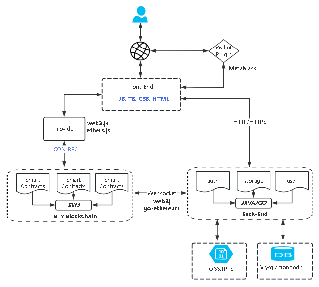

1. 用户登录
用户通过钱包插件（MetaMask等）登录DAPP， 通过前端签名，服务端验签的方式进行身份的验证， 鉴权。 服务端数据库中保存用户的地址信息，来确认用户是第一次登录（相当于注册）还是已经登录过。

2. 合约交互
数据通过钱包插件签名， 并通过web3.js或ethers.js等JS库，同区块链进行交互，调用合约方法，获取数据。

3. 数据监听，订单处理，数据存储以及其它的 DAPP 业务逻辑
服务端通过web3j或go-ethereum等SDK，监听区块链上的数据，来更新订单的状态，数据存储以及实现其它的 DAPP 业务逻辑。并将更新的数据通过前端展示给用户。

## DNS合约介绍
| 合约名称 | 功能介绍 |
| ------ | ---------- | 
| DNSRegistry | 基础域名注册管理合约:  1. 定义子域名分配,转移,解析器变更，域名TTL存活时间发生变更时的事件触发。  2. 设置域名记录，子域名记录，子域名的所有者，域名解析器的合约地址， 域名TTL存活时间。  3. 获取域名所有者， 域名管理者， 域名解析器地址， 域名是否存在等等| 
| Root | 顶级域名管理合约:  1. 定义锁定顶级域名事件。  2. 分配顶级域名， 查看顶级域名相关信息， 回收顶级域名等| 
| PublicResolver | 公共的通用的解析器合约:  1. 移除二级域名信息, 设置反向解析记录, 根据二级域名node获取解析数据。 2. 获取反向解析nodeList, 根据node获取二级域名。 3. 根据一级域名获取下面所有二级域名列表,列表分页查询 |
| ERC721Registrar | 注册具有NFT属性的域名合约:  1. tokenID重复性和有效性检查。  2. ERC721的域名注册,元数据绑定，续费，回收等  3.域名所有权转移  | 

## 功能简介
### 1. 用户登录
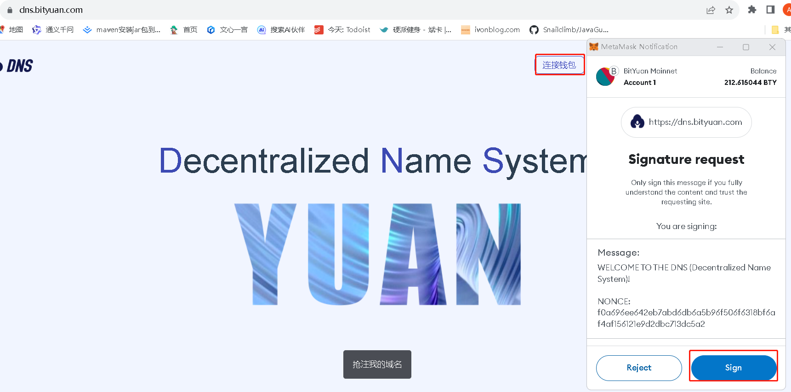
- 通过MetaMask签名数据， 服务端检验签名， 签名验证通过则登录成功。

### 2. 域名注册
#### 2.1 搜索域名
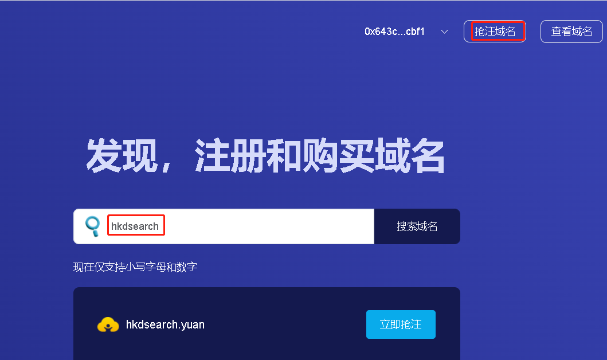
- 前端界面点击[抢注域名], 输入想要注册的名称，点击搜索。
- 如果该名称非保留域名，并且没有被其它人注册， 可以抢注。

#### 2.2 立即购买
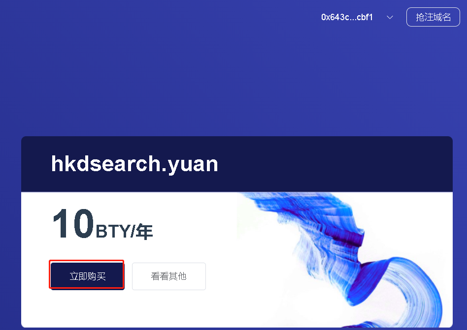
- 进入购买页， 显示该域名的价格，点击[立即购买]

#### 2.3 支付订单
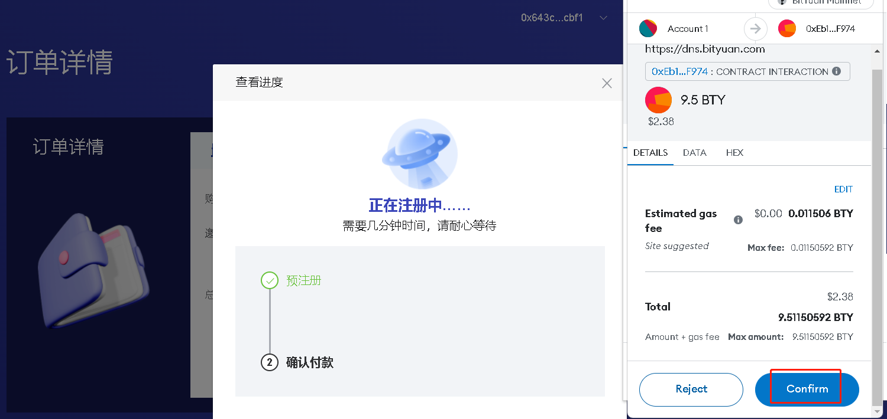
- 在支付页，点击支付，弹出钱包插件，接受交易签名和发送（点击confirm按钮）。
- 交易上链后，等待注册完成

#### 2.4 注册完成
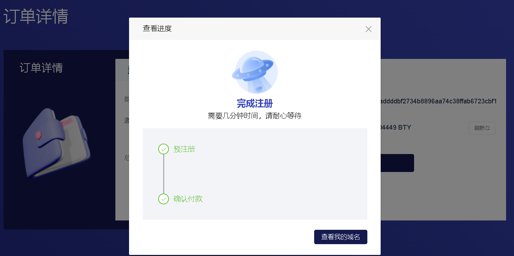
- 当页面上的预注册和确认付款都成功后，代表域名注册成功。

#### 2.5 查看注册的域名
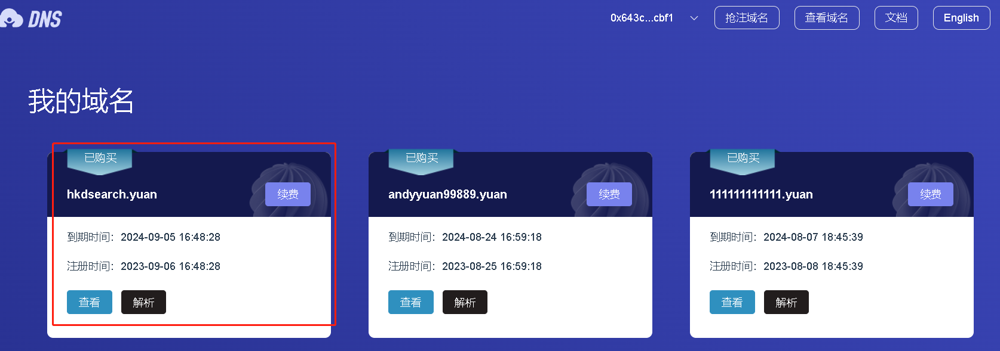
- 在我的域名页面，可以查看到刚刚注册成功的域名。

### 3. 域名续费
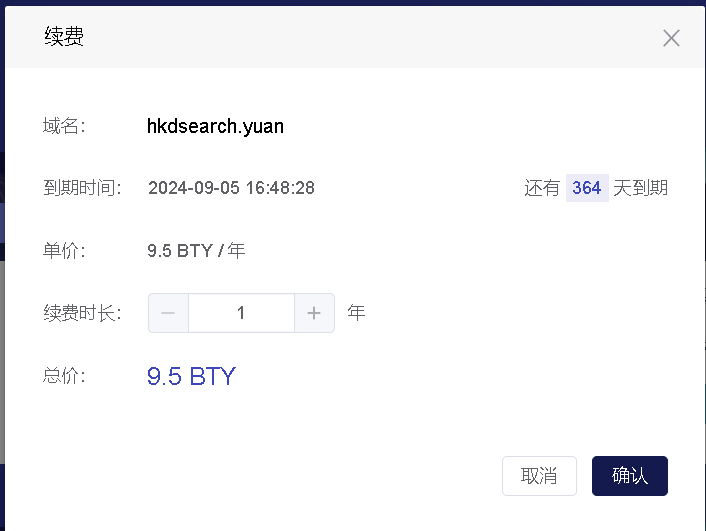
- 选择续费时长，点击确认后，调用钱包插件签名续费交易并发送上链。
- 交易被成功确认后，前端界面展示续费成功。

### 4. 域名解析
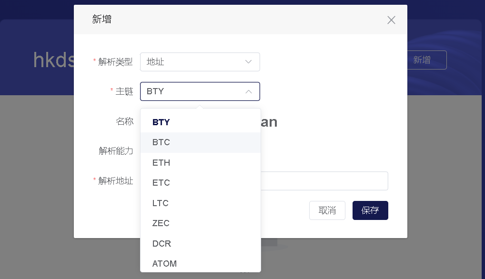
- 系统支持添加多种类型的解析记录（地址，身份信息，以及自定义）
- 地址类型的解析记录支持多种地址类型，比如选择bty，则二级域名是：bty.顶级域名.yuan; 如果选择BTC，则二级域名是：btc.顶级域名.yuan
- 点击保存按钮，则会调用钱包插件签名该交易并上链。
- 添加域名解析记录后，第三方应用可以通过API接口来解析或反向解析记录。

### 5. 域名查询
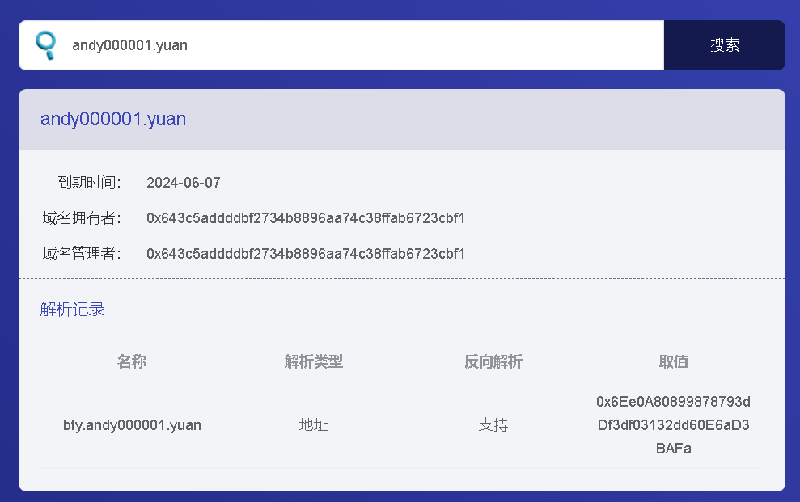
- 通过查看域名页面，可以查看到域名的所有者信息，以及它的解析记录信息。

- ### 5. 域名转让
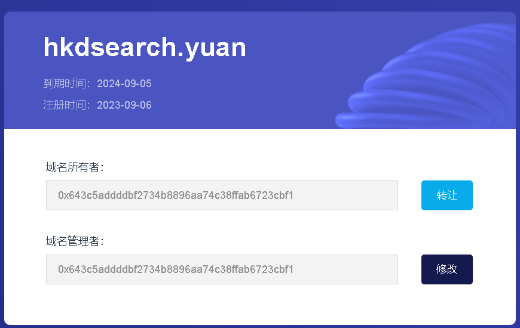
- 用户可以通过转让功能，把属于自己的域名转让给另一个用户，通过输入新用户的地址，再签名该交易并上链。
